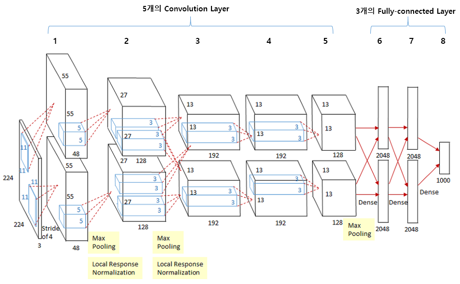

# AlexNet 논문 정리

https://proceedings.neurips.cc/paper_files/paper/2012/file/c399862d3b9d6b76c8436e924a68c45b-Paper.pdf : Alexnet

# 1. 개요

- 이전까지 소규모의 라벨된 이미지된 학습하는 모델만 존재했다.
- 좋은 성능의 모델을 얻기 위해 대규모 크기의 이미지 데이터셋이 필요하게 되었고, 수많은 이미지를 수용할 수 있는 용량을 가진 모델이 필요하게 되었다.
- 단순히 많은 이미지 데이터셋만 필요한게 아니고, 그 데이터를 처리할 수 있는 능력을 가진 모델을 필요로 하게 되었다. 동시대의 다른 모델과 비교했을 때 대규모 데이터셋을 비교할 수 있는 능력을 가지며 연결과 매개변수 수가 적어 학습하기 비교적 쉬운 CNN을 활용하게 되었다.

# 2. 데이터셋

# 3. 아키텍처

## 3-1. ReLU

- tanh나 (1 + e^−x)^−1와 같은 기존의 비선형성 포화 active function는 시간이 오래걸리는 단점이 있다.
- 대규모 데이터셋을 처리하는 대용량 모델의 빠른 학습을 위해 비포화(non-saturating) 비선형성 active function을 사용하게 되었다.
- Gradient Vanishing Problem
- ReLUs have the desirable property that they do not require input normalization to prevent them from saturating.

## 3-2. Training on Multiple GPUs

- 2012년도에는 GTX 580이 나왔다. 지금은 40s를 쓰고 있다.
- GPU의 병렬 사용을 통해 대규모 데이터셋을 빠르게 학습했다.

## 3-3. Local Response Normalization

- lateral inhibition을 막기 위해 고안됨
- Gradient가 양의 값을 가지면 계속 학습을 하겠지만 그런 지역적인 정규화가 일반화(뉴런 사이의 활동을 막는 것)를 가져옴.
- ReLU를 사용하고 나온 결과값이 다른 뉴런의 활동을 억압하는 lateral inhibition을 하는 것을 발견함. 이를 막기 위해 하이퍼파라미터가 들어 잇는 LRN을 사용하게 됨.

## 3-4. Overlapping Pooling

- 같은 kernel map에서 나온 이웃 뉴런들의 결과값을 요약하는 역할을 맡음.
- 전통적인 pooling은 인접한 뉴런의 결과값의 오버랩을 인정하지 않지만 여기서는 진행함.

## 3-5. Overall Architecture

- 처음 5개는 convolution layer, 나머지 3개는 fully connected layer
- 마지막 fully connected layer는 1000개의 way로 결과값을 분류한다.
- 다중 클래스의 분류를 위해 softmax와 cross-entropy loss를 사용함.
- 2, 4, 5번째 convolution layer는 같은 GPU에 있는 이전 layer kernel map에만 연결되어 있다. 전 단계의 같은 채널의 특성맵들만 연결되어 있다.
- 나머지 convolution layer와 fully connected는 이전 layer의 모든 kernel map과 연결된다.
- normalization layer는 처음과 두 번째 convolutional 뒤에 있고, max-pooling layer는 1, 2, 5번째 layer에 있다.

https://velog.io/@lighthouse97/AlexNet%EC%9D%98-%EC%9D%B4%ED%95%B4

# 4. 과적합(overfitting) 방지

- 모델 내에는 6000만개의 파라미터가 존재한다. ILSVRC의 1000개의 클래스는 이미지에서 라벨을 뽑을 때 봅기당 10bit의 제약을 만들어내지만, 파라미터의 수가 많은 만큼 오버피팅을 막아내기에는 부족하다.

## 4.1 Data Augmentation

- 특정 데이터셋에 모델을 과적합하는 걸 방지하기 위해선 데이터가 편항되지 않게 데이터셋이 큰게 좋다. 따라서 인위적으로 데이터를 증강시켜 과적합을 막는다.
- AlexNet에서 사용한 데이터 증강 방법은 두 가지이며 원본 데이터에서 약간의 계산만 하면 되기 때문에 추가적인 디스크가 필요하지 않다. 심지어 GPU가 이전 batch의 이미지를 수행할 때 증강이 실행되기 때문에 컴퓨터 자원의 낭비도 피할 수 있다.

### 4.1.1 image translation (이미지 전사화), horizontal reflection (이미지 수평 반사)

- 이미지 전사화는 특정 물체나 재료에 이미지를 옮겨서 붙이는 것을 뜻합니다.  ⇒ 파파고
- 256x256 이미지에서 224 x 224 patch를 추출해 모델을 훈련시키는데 사용했다.
- 부족한 이미지 크기를 채우는데도 사용되는 이미지 수평 반사를 여기서도 사용된다

### 4.1.2 PCA를 이용한 이미지 차원 축소

- 차원 벡터들 중 영향을 적게 주는 차원을 없애면서 데이터의 특성을 보존하고 용량을 줄이는 기법을 활용함.

## 4.2 Dropout

- 많은 다른 모델들의 예측값을 합치는것은 test error를 줄이는데는 굉장히 좋은 방법이지만, 학습하는데 몇 일이나 걸리는 큰 모델들의 예측값을 더하는건 현실적으로 쉽지 않다.
- 그에 반해 Dropout은 아주 효율적인 방법이다. 이 방법은 은닉층의 뉴런의 결과값을 1/2의 확률로 0으로 만드는 기법이다. 이렇게 만들어진 뉴런은 전파와 역전파의 과정에서 계산에 참여하지 않는다.
- 그래서 모델에 입력값을 넣을 때 뉴럴 네트워크는 다른 아키텍처를 실험하지만 이러한 아키텍처들은 자기들끼리 가중치를 공유한다.
- 이러한 기술은 한 뉴런이 다른 샘플링에 중첩 적용되지 않게 방지해준다. 그래서 각 뉴런이 다양한 조합에서도 잘 작동할 수 있는 강인한 특징(robust features)을 학습하게 만든다.