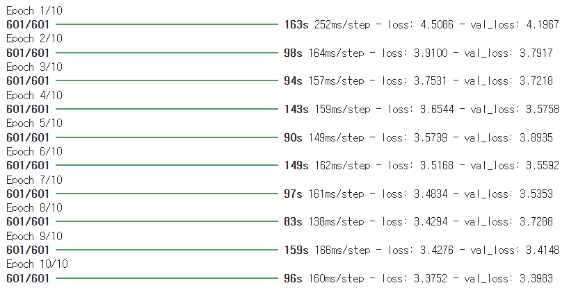

# Age Prediction and Age-Based Face Generation using GAN

## Presentation Video

## 소개
얼굴에서 나이를 인식하는 인식 모델과 나이를 가지고 얼굴을 생성하는 생성 모델을 구현한 프로젝트입니다.

 

## 사용한 자료
1. UTKFace Dataset (얼굴 데이터셋)  
    https://susanqq.github.io/UTKFace/

2. haar-cascade (얼굴 인식기)
   https://github.com/opencv/opencv/tree/master/data/haarcascades

 

## 1부 : 얼굴 인식

### 1. 얼굴 검출기
인물의 나이를 추정하기 위해선 얼굴만 있는 사진이 필요했습니다. 인물 사진에서 얼굴만 검출하는 검출기를 만들어 모델을 학습하기 위한 데이터구성에 사용했습니다.

### 2. 얼굴 인식 모델
VGG16, Xception, AlexNet등 수업 때 배운 모델과 최신 모델을 활용하여 얼굴의 나이를 인식하는 모델을 구현했습니다.

 

## 2부 : 얼굴 생성
### 1. GAN을 이용한 얼굴 생성

단순 생성 모델인 GAN과 UTKFace Dataset을 이용해서 얼굴만 생성하는 생성 모델을 만들었습니다.

 

모델 생성 epoch : 20

### 2. cGAN을 이용한 얼굴 생성
나이라는 조건을 추가해서 cGAN을 이용해 나이대별 얼굴 생성 모델을 만들었습니다.
